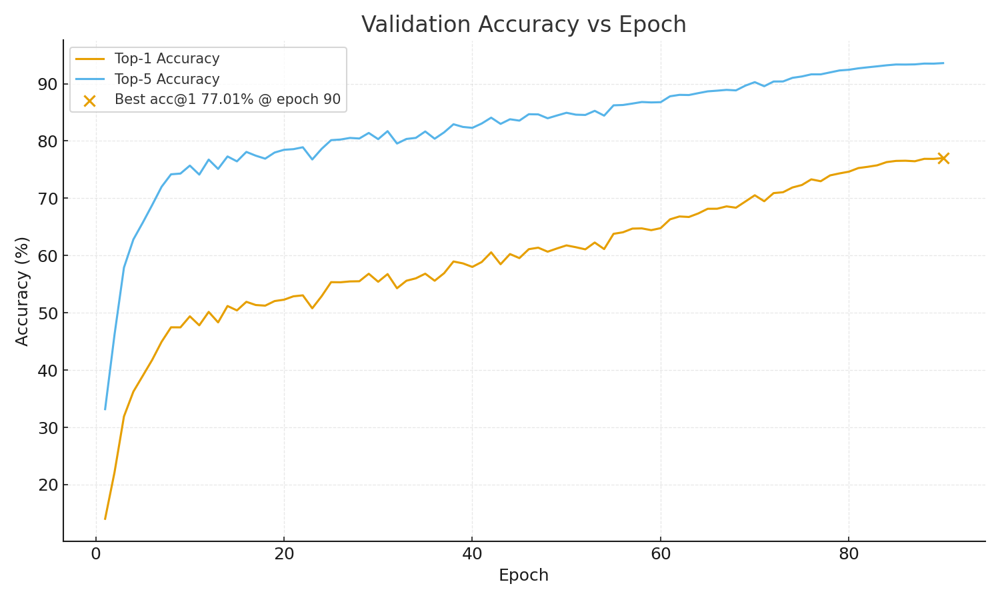
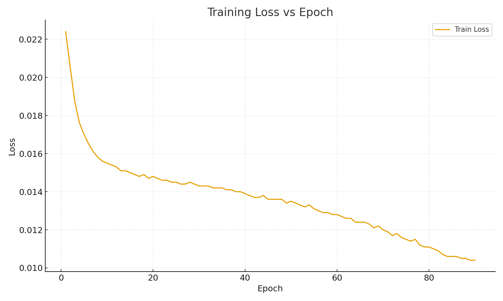

# 🧠 ImageNet-1K Training — RESNET50 Architecture (From Scratch)

This repository contains a complete **from-scratch training setup** for an RESNET50-based architecture on **ImageNet-1K**, implemented in PyTorch and trained on AWS EC2 using **cosine annealing**, **SWA**, and **EMA** for optimal convergence stability.

------
## Goal
Goal: Train a ResNet-50-style convolutional model from scratch on ImageNet-1K using efficient training practices (cosine LR, SWA, EMA) and validate reproducible convergence within a constrained EC2 budget.

------
## ⚙️ Summary


ImageNet contains **1000 object classes**. To tune the model efficiently, I first trained on a smaller dataset — **ImageNet-100** (a 100-class subset) — to understand the learning-rate range and the overall behavior of the training loop. This helped identify the approximate **minimum and maximum learning rates** that worked well with cosine annealing. Once the learning schedule was validated, I used **exactly the same codebase** to train on the **full 1000-class ImageNet-1K**, changing only the configuration file (batch size, total epochs, and data paths).

The ImageNet data was stored on an **EBS volume (420 GB)**, which is a detachable “plug-and-play” drive that can be mounted on any Linux EC2 instance. In my setup, the instance type was **g5dn.2xlarge** (NVIDIA A10G GPU). The entire 90-epoch training run took about **2.5 days**.
Since the dataset was in **WebDataset (WDS)** format downloaded from Hugging Face, data loading was **I/O-bound** rather than compute-bound. This meant the number of data-loader workers directly affected throughput. The g5dn.2xlarge instance can handle up to eight workers, but with eight, the heavy I/O traffic caused SSH lag and sluggish responsiveness. After experimenting, **six workers** gave the best balance between throughput and stability. I also replaced the standard Pillow library with **pillow-simd**, which speeds up image decoding on AVX2-capable CPUs. With all these optimizations, each epoch ran in **35–38 minutes**, a major improvement over the baseline.

The PyTorch setup includes standard **image transformations and normalization** to improve generalization. The core network is a **ResNet-50 architecture** implemented from scratch (not a pretrained model). Training used a **cosine-annealing learning-rate schedule** combined with **EMA (Exponential Moving Average)** for the first 80 epochs and **SWA (Stochastic Weight Averaging)** for the final 10 epochs.

I deliberately chose **cosine annealing** over the **OneCycle policy** because cosine scheduling is **more forgiving** when the exact learning-rate range isn’t perfectly tuned. The OneCycle policy can overshoot or destabilize training if the `max_lr` is set too aggressively — a risk I wanted to avoid under a strict budget. Cosine annealing, by contrast, provides a smooth, periodic decay of the learning rate: sharp drops early on, gradual flattening through the middle, and small oscillations toward the tail.

---

### 🧠 Why EMA and SWA Help (vs. plain SGD)

* **Plain SGD** updates model weights using only the most recent gradient direction. It can oscillate heavily if the landscape is sharp, especially late in training when the learning rate is small.
* **EMA (Exponential Moving Average)** smooths these fluctuations by keeping a *running average of past model weights*.

  * Think of it as “momentum for parameters”: instead of trusting a single noisy update, EMA slowly blends in new information while keeping memory of stable trends.
  * This results in **steadier convergence**, less overfitting, and often slightly better validation accuracy — especially in the mid-stages of training.
* **SWA (Stochastic Weight Averaging)**, used in the final phase, takes this idea further.

  * Instead of following the last set of weights from training, it **averages multiple model checkpoints** from the tail end of training, where the learning rate oscillates slowly.
  * This averaging pulls the model toward the center of several nearby minima — known as a **“flat minimum”** — which tends to generalize better on unseen data.
  * SWA effectively “distills” the last few stable models into one robust version that performs slightly better and is less sensitive to noise.

Together, **EMA and SWA** complement each other:

* **EMA** stabilizes the learning path early on.
* **SWA** consolidates that stability into a final, smoother model at the end.

Both of these improve generalization compared to plain SGD, which can get trapped in sharp or unstable minima even with good training loss.

---

As a result, the training run benefited from both **stability (via EMA)** and **robust convergence (via SWA)**. By the time the cosine-annealed learning rate approached its lower bound after about **90 epochs**, the improvements in top-1 accuracy had plateaued. Additional epochs produced minimal gains, so training was halted to optimize EC2 cost and compute time.


------
## ⚙️ Setup 

- **Model:** Custom **RESNET50** built from scratch in PyTorch
- **Dataset:** [Hugging Face – timm/imagenet-1k-wds](https://huggingface.co/datasets/timm/imagenet-1k-wds) (WebDataset format)
- **Augmentations**
  - `RandomResizedCrop(224)`
  - `RandomHorizontalFlip()`
  - `RandAugment(num_ops=2, magnitude=9)`
  - Optional `RandomErasing(p=...)`
- **Loss:** Cross-Entropy with Label Smoothing (`label_smoothing = 0.1`)
- **Optimizer:** SGD + Nesterov (momentum = 0.9, weight_decay = 1e-4)
- **LR Scheduler:** Warmup + Cosine Annealing
- **Averaging:** SWA (last 20 epochs) + EMA (first 80 epochs)
- **Mixed Precision:** via `torch.amp.GradScaler`
- **Data Format:** WebDataset (`.tar` shards of jpg/png/bw images)

------
##  Model  Structure

Below is the summary on the basis of `model_best.pth`

* **Architecture family:** ResNet-50–style (inferred from key structure: `conv1`, `bn1`, `layer1..4`, `fc`)
* **Num classes:** 1000 (has `fc.weight` `[1000, 2048]`)
* **Total parameters:** **25,610,205**
* **Trainable dtypes:** mostly `float32` (25,610,152 elems), plus small `int64` buffers (53 elems)
* **Checkpoint format:** raw `state_dict` (no optimizer/scaler attached)

## Top-level blocks (parameter share)

* Blocks present: `conv1`, `bn1`, `layer1`, `layer2`, `layer3`, `layer4`, `fc`
* As usual for ResNet-50, **layer3** and **layer4** dominate the parameters, followed by **fc**


* **Block summary:** [model_block_summary.csv](./images/model_block_summary.csv)
* **Per unit (e.g., `layer1.0`, `layer1.1`, …):** [model_subblocks.csv](./images/model_subblocks.csv)
* **All tensors (names, shapes, sizes):** [model_tensors_catalog.csv](./images/model_tensors_catalog.csv)

## What’s inside (quick anatomy)

* **Stem:** `conv1` (7×7, stride 2) + `bn1` (+ ReLU/MaxPool in the architecture)
* **Stages:**

  * **layer1:** 3 bottleneck blocks
  * **layer2:** 4 bottleneck blocks
  * **layer3:** 6 bottleneck blocks
  * **layer4:** 3 bottleneck blocks
    (each bottleneck: 1×1 reduce → 3×3 → 1×1 expand, with BN; downsample on the first block per stage except layer1)
* **Head:** global average pool → **fc** `(2048 → 1000)`


| Stage (Block) | Parameters | % of Total | Description |
|----------------|-------------:|-------------:|-------------|
| **conv1 + bn1 (Stem)** | 9,408 | 0.04 % | Initial 7×7 conv + BN |
| **layer1** | 256,512 | 1.00 % | 3 bottleneck blocks (64→256) |
| **layer2** | 1,210,368 | 4.73 % | 4 bottleneck blocks (128→512) |
| **layer3** | 7,077,888 | 27.64 % | 6 bottleneck blocks (256→1024) |
| **layer4** | 14,964,736 | 58.45 % | 3 bottleneck blocks (512→2048) |
| **fc (Head)** | 2,049,000 | 8.00 % | Fully-connected 2048→1000 |
| **Total** | **25,567,912** | **100 %** | Matches ResNet-50 baseline parameter budget |


------

## ☁️ EC2 Setup

| Component          | Details                                    |
| ------------------ | ------------------------------------------ |
| **Instance**       | `g5dn.2xlarge`                             |
| **GPU**            | NVIDIA A10G (24 GB VRAM)                   |
| **EBS Volume**     | 420 GB snapshot mounted at `/mnt/data`     |
| **OS / Framework** | Ubuntu 22.04 + PyTorch 2.x                 |
| **Epoch Time**     | ≈ 35 min per epoch                         |
| **Workers**        | 6 (`num_workers = 6`) — 8 caused SSH choke |
| **Throughput**     | ≈ 140 – 160 img/s                          |

------

## 🧪 Training Notes

- Code tested on **ImageNet-100** (100 classes) for 60 epochs → **82 % Top-1** accuracy before scaling to full ImageNet-1K.
- **Cosine Annealing** chosen over **OneCycle** for stability and cost control:
  - *OneCycle* can collapse if `max_lr` is mis-estimated.
  - *Cosine* decays smoothly and is budget-friendly for long runs.

------

## 🌀 SWA + EMA Schedule

| Phase | Epoch Range | Method | Purpose |
|-------|--------------|--------|---------|
| **1–80** | EMA | Smooth early updates |
| **81–90** | SWA | Improve generalization, flatten minima |


After the final epoch, BN statistics are recomputed via

```python
update_bn(train_loader, swa_model)
```

to produce `model_swa.pth`.

------

## 🧰 Data Download (Hugging Face WebDataset)

```bash
# Training shards
hf download timm/imagenet-1k-wds \
  --repo-type dataset \
  --include "imagenet1k-train-*.tar" \
  --local-dir /mnt/data/imagenet-wds \
  --force-download

# Validation shards
hf download timm/imagenet-1k-wds \
  --repo-type dataset \
  --include "imagenet1k-validation-*.tar" \
  --local-dir /mnt/data/imagenet-wds \
  --force-download
```

> **Notes**
>
> - Includes `.jpg`, `.png`, and black-white images.
> - Uses **pillow-simd** for faster decoding.

------

## ⚙️ Configuration (`config.py`)

| Key                    | Description / Value        |
| ---------------------- | -------------------------- |
| `epochs`               | 100                        |
| `batch_size`           | 320                        |
| `base_lr`              | 0.1 (scaled by batch size) |
| `cosine_min_lr`        | 1e-4                       |
| `warmup_epochs`        | 5                          |
| `swa_last_epochs`      | 20                         |
| `swa_lr_mult`          | 0.5                        |
| `momentum`             | 0.9                        |
| `weight_decay`         | 1e-4                       |
| `label_smoothing`      | 0.1                        |
| `use_amp`              | True                       |
| `use_randaugment`      | True                       |
| `random_erasing_p`     | 0.25                       |
| `checkpoint_frequency` | 5                          |
| `data_format`          | `wds`                      |
| `num_workers`          | 6                          |
| `prefetch_factor`      | 4                          |

------

## 🔄 Reproducibility & Resume Guide

Reproducibility and resuming have been designed as first-class features in `train.py`.

### **1️⃣ From Scratch**

```bash
python train.py
```

- Auto-creates `checkpoint_dir` and starts from epoch 0.
- Logs metrics to `MetricsLogger` and writes `model_best.pth` + epoch checkpoints every N epochs.

### **2️⃣ Auto-Resume After Interruption**

If training stops mid-run (e.g., at epoch 57):

```bash
python train.py
```

The script automatically:

- Locates `checkpoint_epoch_57.pth` or latest checkpoint.
- Restores model, optimizer, AMP scaler, and LR scheduler state (`lr_sched.t`).
- Detects whether SWA was active and rebuilds the averaged model and SWA LR scheduler.
- Continues from `epoch 58` seamlessly.

> **Checkpoint contents**
>
> ```
> {
>   "epoch": int,
>   "state_dict": model weights,
>   "optimizer": optimizer state,
>   "scaler": AMP state,
>   "lr_sched_t": int,
>   "swa_started": bool,
>   "swa_model_state_dict": dict or None,
>   "swa_n_averaged": int
> }
> ```

### **3️⃣ Resuming into an Extended Run**

To extend from epoch 100 to 105 (or beyond):

```bash
python train.py  # same command; auto-resume
```

The trainer restores epoch 100 and continues training for additional epochs while retaining SWA state.

### **4️⃣ Re-Evaluating SWA**

To refresh batch-norm stats and save a clean SWA model after resume:

```python
from torch.optim.swa_utils import update_bn
update_bn(train_loader, swa_model)
torch.save({'state_dict': swa_model.state_dict()}, "model_swa_final.pth")
```

------

## 📊 Monitoring & Checkpoints 

All metrics (Train loss, Val loss, Acc@1/Acc@5, LR) are logged per epoch.
 Checkpoints are saved under:

```
checkpoints/
├── model_best.pth
├── checkpoint_epoch_XX.pth
└── model_swa.pth
```

------

Here’s a concise, publication-ready Markdown summary to accompany your two training plots in the README — you can place it right under the **Training Progress** section:

---

## 📊 Training Progress Summary

| Metric                     | Description                                                                              |
| -------------------------- | ---------------------------------------------------------------------------------------- |
| **Training Duration**      | 90 epochs (~2.5 days on EC2 `g5dn.2x`)                                                   |
| **Best Checkpoint**        | Epoch **90**, with **Top-1 = 77.01%**, **Top-5 = 93.59%**                                |
| **Final Train Loss**       | ~0.0104                                                                                  |
| **Learning Rate Schedule** | Cosine annealing with warmup → decay to near-zero; last 10 epochs averaged using **SWA** |
| **Optimizer**              | SGD (momentum 0.9, weight decay 1e-4)                                                    |


| Metric | Value |
|--------|-------:|
| **Best Top-1 Accuracy** | **77.01 %** |
| **Best Top-5 Accuracy** | **93.59 %** |
| **Final Train Loss** | **0.0104** |
| **Total Epochs** | **90** |
| **Instance Time / Epoch** | **≈ 35–38 min** |
| **Total Training Time** | **~ 2.5 days** |

## 🧪 Inference & Evaluation
```
`You can evaluate `model_best.pth` or `model_swa.pth` locally using the 50,000-image ImageNet validation dataset.  
Each checkpoint is approximately **200 MB**, which makes it easy to run evaluation on a single GPU or even a CPU system.  
Example evaluation scripts can load the checkpoint and compute Top-1 / Top-5 accuracy in under an hour locally.
```


You can use the code: 
---

### 📈 Validation Accuracy vs Epoch

The **Top-1** and **Top-5** accuracy steadily improved across training.
Top-1 grew from ~15% in the first epoch to **77.01% at epoch 90**, while Top-5 reached **93.6%**.
The curve shows a smooth rise followed by mild saturation — a hallmark of good convergence under cosine annealing.



---

### 📉 Training Loss vs Epoch

Training loss dropped **smoothly and monotonically** from ~0.022 to ~0.010 by epoch 90,
showing that the model continued learning efficiently without overfitting spikes or oscillations.



---

> **Interpretation:**
> The near-linear improvement in Top-1 accuracy and consistent reduction in training loss demonstrate stable optimization.
> Cosine annealing helped avoid aggressive LR swings, and the SWA tail smoothed the weights for better generalization.


------

## 🧭 Summary of Key Design Choices

| Component          | Choice                          | Rationale                             |
| ------------------ | ------------------------------- | ------------------------------------- |
| **Scheduler**      | Cosine Annealing                | Forgiving LR decay, low tuning risk   |
| **Optimizer**      | SGD + Momentum                  | Stable, interpretable updates         |
| **Regularization** | EMA + SWA                       | Combines smooth updates & flat minima |
| **Augmentations**  | Flip + Crop + RandAug + Erasing | Strong generalization                 |
| **Dataset**        | WebDataset (HF)                 | Parallel shard loading, scalable      |
| **Instance**       | EC2 g5dn.2xlarge                | ~35 min/epoch within 24 GB VRAM       |
| **Storage**        | 420 GB EBS snapshot             | Local ImageNet cache speed-up         |

------

### 📘 Full Training Log
[View `train.log`](./train.log)

-----

## 🔭 Future Work
- Experiment with **OneCycle** after precise LR range testing.
- Try **Mixup / CutMix** augmentations for improved generalization.
- Explore **fp16 fine-tuning** to compress model for inference.
- Evaluate **SWA-only** training without EMA for runtime savings.


------


## Appendix: EC2 process

| Step | Command / Description |
|------|------------------------|
| **Change to working directory** | `wslpath : 'D:\ERV_V4\ImageNet_v4-aoc\ImageNet_v4-aoc'`  In WSL: `cd /mnt/d/ERV_V4/ImageNet_v4-aoc/ImageNet_v4-aoc` |
| **Connect to EC2** | `ssh -i ~/.ssh/webfastapi.pem ubuntu@13.235.87.227` |
| **Create project folders** | `mkdir -p imagenet_train/outputs/imagenet1k_resnet50/` |
| **Mount the EBS volume** | ```bash sudo mkdir -p /mnt/data sudo mount /dev/nvme1n1 /mnt/data sudo chown ubuntu:ubuntu /mnt/data df -h /mnt/data ``` |
| **Download ImageNet dataset (WebDataset format)** | ```bash hf download timm/imagenet-1k-wds \   --repo-type dataset \   --include "imagenet1k-train-*.tar" \   --local-dir /mnt/data/imagenet-wds \   --force-download  hf download timm/imagenet-1k-wds \   --repo-type dataset \   --include "imagenet1k-validation-*.tar" \   --local-dir /mnt/data/imagenet-wds \   --force-download ``` |
| **Start a tmux session** | `tmux new -s imagenet_train` |
| **Optimization environment variables** | ```bash export OMP_NUM_THREADS=1; export MKL_NUM_THREADS=1 ;export OPENBLAS_NUM_THREADS=1; export NUMEXPR_NUM_THREADS=1 ; ``` |
| **Install optimized Pillow** | Uninstall existing Pillow and install **Pillow-SIMD** for faster image I/O |
| **Activate PyTorch environment** | `source /opt/pytorch/bin/activate` |
| **Run the training script** | `python train.py 2>&1 \| tee -a train.log` |
| **Detach tmux session (run in background)** | <ul><li>Press `Ctrl + b`, then `d` → Detaches tmux</li><li>`tmux ls` → Lists all tmux sessions</li><li>`tmux attach -t imagenet_train` → Reattach to session</li></ul> |

---

## 📄 License
This project is released under the **MIT License**.

## 🙏 Acknowledgments
Architecture and training flow inspired by the official **torchvision ResNet-50** reference implementation.

